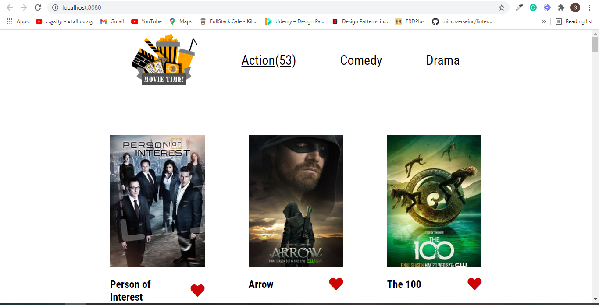
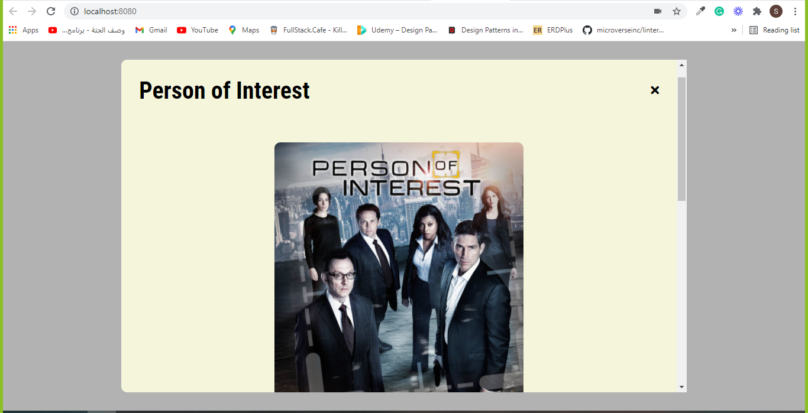

# Movie Time

> Project for showing movies give them likes and comments on them.

 home page                                  |  comment popup
:------------------------------------------:|:---------------------------------------:
  |  


## Built With

- HTML, CSS, and JavaScript
- Webpack
- Jest
- Github projects
- Kanban board

## Live Demo

[Live Demo Link](https://github.com/ShahierNashaat/javascript-capstone/dist)

## Video Description

[Video Link](https://www.loom.com/share/4f60fdc9b8134deda2c9b5a94bc9eca6)


## Getting Started

To get a local copy up and running follow these simple example steps.

- go to the directory that you want to clone the repository in.
- right click and choose Git Bash here.
- type ```git clone https://github.com/ShahierNashaat/javascript-capstone.git```.
- run "npm install" and then "npm start"


## Authors

👤 **Shahier Nashaat**

- GitHub: [@githubhandle](https://github.com/ShahierNashaat)
- Twitter: [@twitterhandle](https://twitter.com/ShahierN)
- LinkedIn: [LinkedIn](https://www.linkedin.com/in/shahier-nashaat-73519313a/)

👤 **Okpara Tochukwu**

- GitHub: [@xtrahuman](https://github.com/xtrahuman)
- LinkedIn: [LinkedIn](https://linkedin.com/in/tochukwu-okpara-449528197)

## 🤝 Contributing

Contributions, issues, and feature requests are welcome!

Feel free to check the [issues page](../../issues/).

## Show your support

Give a ⭐️ if you like this project!

## Acknowledgments

- Hat tip to anyone whose code was used
- Inspiration
- etc

## 📝 License

This project is [MIT](./MIT.md) licensed.
